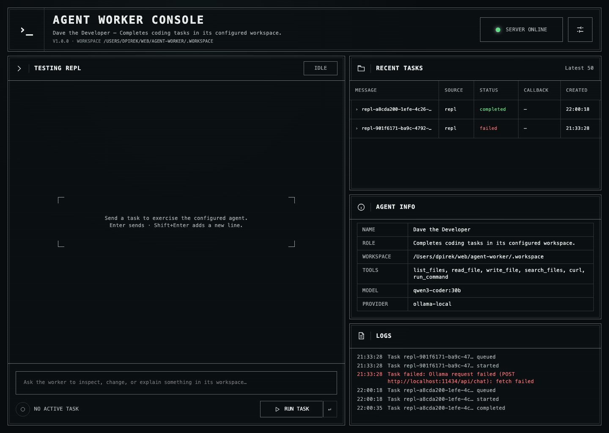

# Agent Worker



An asynchronous coding worker built on the agentic harness in `lib/`. It accepts a task over HTTP,
immediately acknowledges it, runs a fresh `CodingAgent`, and POSTs the final result back to the
caller's callback URL.

For an integration contract that can be handed directly to another agent or orchestrator, see
[`docs/AGENT-INTEGRATION.md`](docs/AGENT-INTEGRATION.md).

## Run

Node.js 22.5 or newer is required for the built-in SQLite task store.
Copy the example configuration, edit it for the selected provider, and start the worker:

```sh
cp .env.example .env
# Edit PROVIDER_NAME, PROVIDER_URL, PROVIDER_API_KEY, and PROVIDER_MODEL in .env.
npm start
```

The server listens on `0.0.0.0:3000` by default. Open `/` for a browser testing REPL and live agent
status. The agent card is available at `GET /.well-known/agent-card.json`; `GET /health` provides a
minimal health check, while `GET /api/status` reports redacted configuration, queue, and task state.
Recent task history is persisted to `db/tasks.sqlite` by default, so the latest 50 tasks remain
visible in the console after a restart. Override the location with `WORKER_TASK_DB`.

All runtime configuration, provider options, callback settings, and tool permissions are listed in
`.env.example`. It also includes editable copies of every default system prompt. Shell environment
variables take precedence over values loaded from `.env`.

The worker auto-approves only the tools named in `WORKER_TOOLS`, because no interactive user is
present to answer approval prompts. Set `WORKER_TOOLS` explicitly to reduce its capabilities.
Agent-created files and commands are isolated to `.workspace/` by default. The directory is created
automatically when the server starts and is excluded from Git. Files in that directory are available
at `GET /workspace/{workspace-relative-path}`. Agent replies use Markdown and include HTTP links for
files created with the file-writing tool.

## Send a task

```sh
curl http://localhost:3000/a2a \
  -H 'content-type: application/json' \
  -d '{
    "message": {
      "messageId": "msg-001",
      "role": "user",
      "parts": [{ "kind": "text", "text": "Inspect the project and fix the failing tests." }]
    },
    "callback": {
      "url": "https://orchestrator.example.com/a2a/callback",
      "token": "callback-secret-xyz"
    }
  }'
```

The worker responds with HTTP `202` and a generated `taskId`. Reusing a `messageId` is idempotent:
the existing task is returned and is not run again.

When the task finishes, the callback receives `Authorization: Bearer <token>` and:

```json
{
  "taskId": "generated-uuid",
  "inReplyTo": "msg-001",
  "status": { "state": "completed" },
  "message": {
    "messageId": "result-generated-uuid",
    "role": "agent",
    "parts": [{ "kind": "text", "text": "The agent's final result." }]
  }
}
```

Failures are also sent to the callback with `status.state` set to `failed` and an `error` object.
Callback delivery is attempted three times by default.
